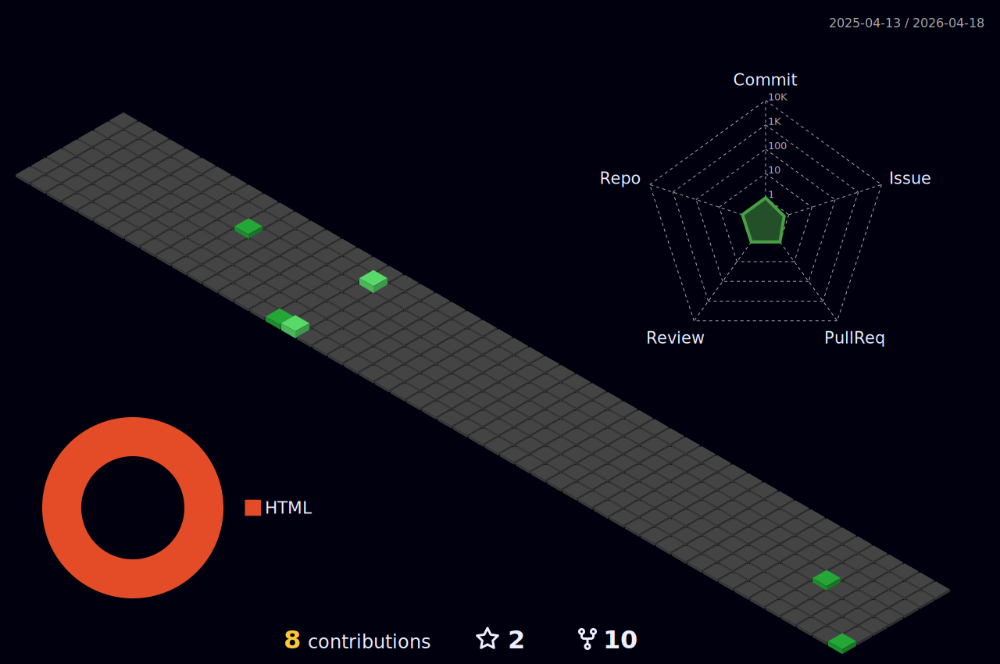

<h1 align="center">VENHA PARA O LADO NEGRO DA PIPELINE DA FORÇA 🎲</h1>
 
      

### Sobre mim

Minha jornada na área de Tecnologia da Informação começou em 2007, quando realizei um curso básico em hardware. Esse foi o primeiro passo que despertou meu interesse pelo campo de TI e me motivou a buscar mais conhecimentos.

Em 2016, decidi aprofundar meus estudos e iniciei um curso técnico em Suporte e Manutenção em Informática, o qual concluí em 2018. Durante esse período, tive a oportunidade de trabalhar como técnico de TI em uma empresa do polo industrial de Manaus. Essa experiência prática foi fundamental para consolidar meu aprendizado teórico e desenvolver habilidades essenciais no suporte técnico.

Em 2019, resolvi dar um passo adiante na minha carreira e comecei a graduação em Análise e Desenvolvimento de Sistemas. Concluí essa etapa em 2021, período no qual aprendi a programar e desenvolver sistemas, além de aprimorar minhas competências em análise de dados e gestão de projetos de TI.

Com a conclusão da graduação, em 2022 mudei de função e iniciei minha trajetória como Engenheiro de Dados em uma empresa de tecnologia em São Paulo. Fui alocado como terceirizado no setor Bancário, onde atuei em diversos projetos estratégicos. Minhas principais responsabilidades incluíam a manipulação e tratamento de dados, utilizando ferramentas como SQL, PostgreSQL, Oracle, entre outras. Essa função me proporcionou uma visão aprofundada sobre o papel dos dados nas decisões empresariais e me motivou a continuar investindo na minha formação.

Durante esse período, concluí duas pós-graduações em Ciência de Dados, o que ampliou significativamente meus conhecimentos em análise de dados e machine learning. Atualmente, estou matriculado na minha terceira pós-graduação, desta vez em Engenharia de Dados. Continuo atuando no setor bancário, desempenhando a função de tratador de dados, e estou constantemente em busca de aprimorar minhas habilidades técnicas e estratégicas.

Minha trajetória é marcada pelo contínuo aprendizado e pela busca por desafios que me permitam crescer profissionalmente e contribuir de maneira significativa para as organizações em que atuo. 🎲👨‍💻

  

<!-- Isso é um comentário, não irá aparecer no seu perfil
(Abaixo você seleciona o curso que você está fazendo no momento) -->

🎓 Eu estudo [[ Apache HOP](https://hop.apache.org/) | [Pentaho](https://help.hitachivantara.com/Documentation/Pentaho/8.3/Products/Pentaho_Data_Integration) | [SQL Server Integration Services](https://learn.microsoft.com/en-us/sql/integration-services/sql-server-integration-services?view=sql-server-ver16) ] 

<!--
👩‍💻 Atualmente eu trabalho como [Cargo] @ [Empresa atual]
🔎 Também sou curioso sobre [Temas que você gosta]
✒️ Eu gosto de no meu tempo livre [Coisas que você gosta de fazer no tempo livre];
📚 Lendo: [Livro que está lendo atualmente]
-->

### Eu já trabalhei com... 🔧

**Tecnologias e Ferramentas**

<!-- (Aqui você pode adicionar tecnologias que aprendeu no curso, já listamos algumas delas, e outras que já domina)) -->

 <a href="https://azure.microsoft.com/en-in/" target="_blank" rel="noreferrer">  
 

 
 

<a href="https://www.mongodb.com/" target="_blank" rel="noreferrer"> 

<!-- (Já colocar tecnologias do On Demand que aprende no curso)) -->

<!--
### Eu estou estudando... 🧩
<!-- (Aqui você pode adicionar tecnologias que está estudando, inclusive para aumentar essa lista você listamos algumas das tecnologias ensinadas na nossa [Assinatura On Demand](https://cubos.academy/cubosondemand)) -->
<!--

<!-- (Você pode adicionar novas tecnologias insira )
-->

### Alguns cursos realizados 🤓

<!-- (Aqui você pode adicionar cursos que você já fez) -->

<!--
Substitua o usuário riversdiniz pelo seu usuário no GitHub.
-->

### GitHub Estatísticas ⚡

<!-- <a href="https://github.com/riversdiniz">

 -->

### Entre em contato comigo! 📭

 
Se você é bom em alguma coisa, nunca a faça de graça. 🦇
